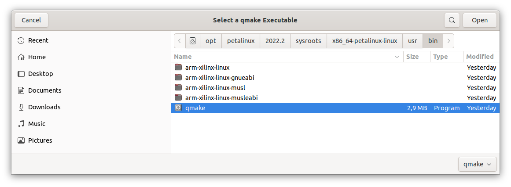
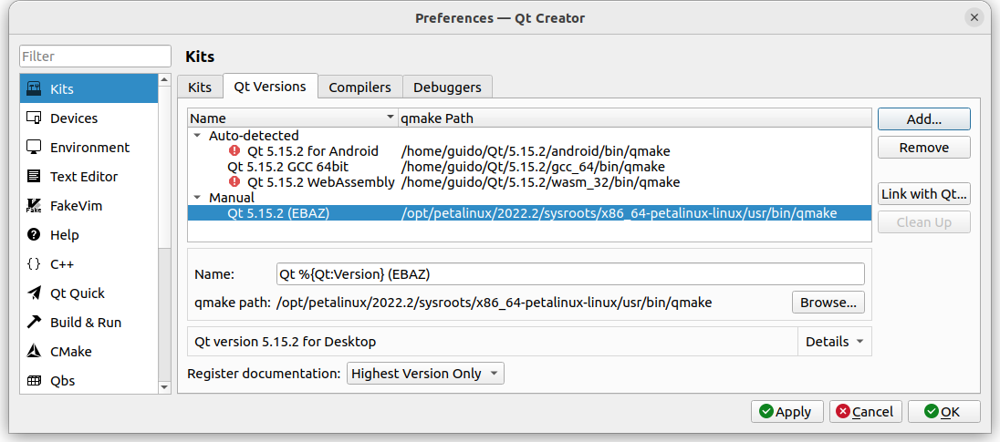

# Overview

This is the sdr-app C++ software receiving sampled data from EBAZ4205 and displaying spectrum and waterfall TODO) in its User Interface.
It lets you to send commands to EBA4205 also to:
  * switch between the ADC input and a local RF test generator  
  * change the local RF test generator frequency in the range 100 KHz - 32 MHz
  * tune radio stations 
  * Set IF bandwith and IF gain  
  

# enable SSH login without password
To cross compile with qt creator you necessarily need to ssh login to PetalLinux without password, copying the public key of your Ubuntu PC (where Qt Creator runs) to the PetaLinux environment on EBAZ4205

1. On Ubuntu, generate an SSH public key. [See the insructions here](https://tecnstuff.net/how-to-set-up-ssh-keys-on-ubuntu-22-04/) 
2. On PetaLinux, create the directory .ssh under /home/ebaz
3. On PetaLinux, copy the public key created at 1. "id_rsa.pub" to /home/ebaz/.ssh renaming it to "authorized_keys"
4. On Ubuntu, try to ssh to PetaLinux: if everything is OK, you should login without password
```
ssh ebaz@192.168.1.250
ebaz4205:~$ 
```
# create a qt creator "kit" for PetaLinux
If you want to compile, build, remotely debug and remotely run Qt5 C++ programs for PetaLinux from your powerful Ubuntu PC, you need to set your "qt creator properly", creating a so called "kit". Unfortunately a qt creator kit cannot be copied/cloned/imported so you need to set it by hand.

1. cd to your work "qt creator" directory
```
cd /home/guido/Github/EBAZ4205_SDR_spectrum/qt5
```
 
2. source the previously created cross compiler environment (so called toolchain). [See the PetaLinux directory](../PetaLinux#build-petalinux-sysroot-and-get-crosscompilers)
```
source /opt/petalinux/2022.2/environment-setup-cortexa9t2hf-neon-xilinx-linux-gnueabi 
```
3. run "qt creator"
```
/home/guido/Qt/Tools/QtCreator/bin/qtcreator
```
4. go to Edit/Preferences/kits/compilers. If you correctly sourced the environment at 2. you should see something like this:


5. go to Edit/Preferences/kits/debuggers. If you correctly sourced the environment at 2. you should see something like this:


6. go to Edit/Preferences/kits/Qt Versions and click "add" to add a new Qt Version named "Qt 5.15.2 (EBAZ)
7. click on add
8. select the qmake program
    
9. change "System" with "EBAZ" for better recognition. The final Qt versions screen should appear in this way
    
   
