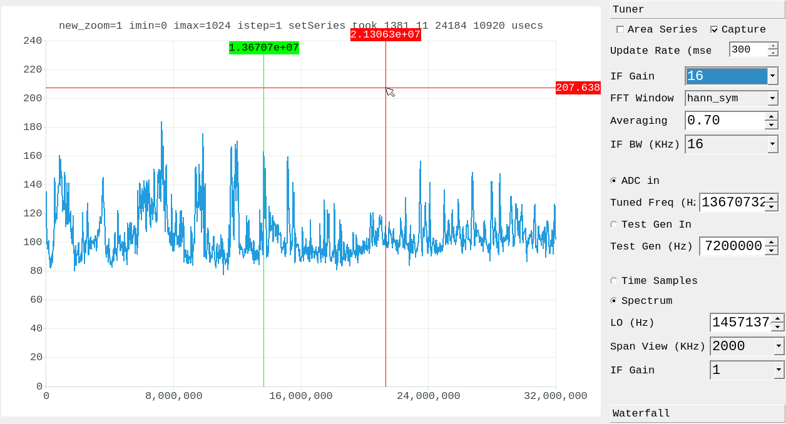

# Overview

This is the sdr-app C++ software receiving sampled data from EBAZ4205 and displaying spectrum and waterfall TODO) in its User Interface.
It lets you to send commands to EBA4205 also to:
  * switch between the ADC input and a local RF test generator  
  * change the local RF test generator frequency in the range 100 KHz - 32 MHz
  * tune radio stations 
  * Set IF bandwith and IF gain  
  

# Software architecture
* main.cpp the classical main for qt5 applications
* mainwindow.cpp and mainwindow.ui are ... the mainwindow!
* spchartview.cpp is the spectrum window. It handles the sampled data, make the FFT and show it on the screen. It also intercepts the mouse events to change the tuned frequency on mousewheel event and so on
* mysettings.cpp save and restore settings in /home/ebaz/.config/sdr-app/sdr-app.ini
* crosshairs.cpp creates the red vert/horiz pointer
* freqvline.cpp creates the vertical lines:
  * green for the tuned frequency
  * black for the lower and higher bandwidth boundaries
* uio.cpp contains all the classes to interface the hardware components by /dev/uiox. For instance:
  * the switch to set the ADC input or the test generator is handled by the class ADCTestSwitch
  * the local oscillator is handle by the class DDS
  * ...
